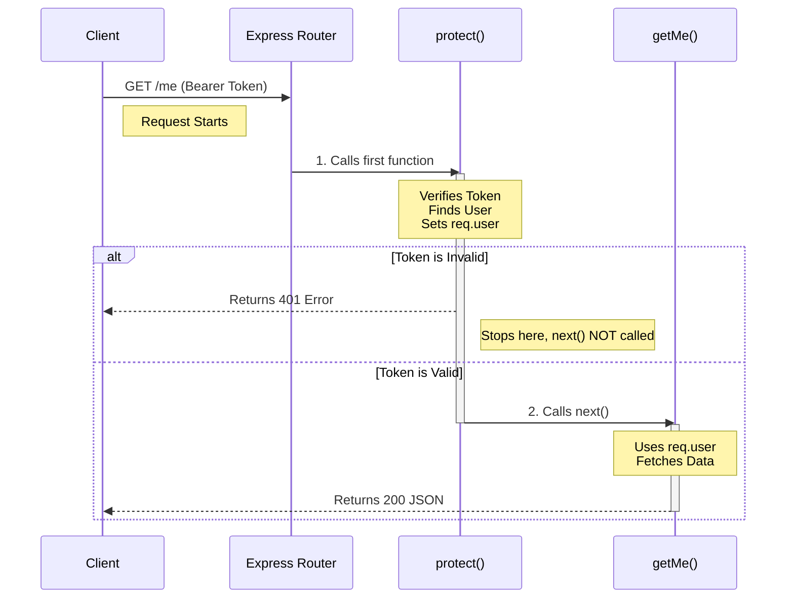

# Protected Route Execution Flow

This document explains exactly how a request travels from the user to your protected controller.

## The Key Concept: Middleware Chaining

In Express.js, functions defined in a route are executed **sequentially** (left to right).

Look at your route definition in `src/routes/authRoutes.js`:

```javascript
//           Path      Middleware    Controller
//            |            |             |
router.get('/me',      protect,      getMe);
```

When a request comes in, Express sees two functions registered for this route: `protect` and `getMe`.

## Step-by-Step Flow

### 1. The Request
The user sends a request:
-   **Method**: `GET`
-   **URL**: `/api/v1/auth/me`
-   **Headers**: `Authorization: Bearer <valid_token>`

### 2. Express Router
The router matches the URL `/me`. It looks at the first function provided: `protect`.

### 3. Inside `protect` (The Middleware)
The execution enters your `protect` function in `src/middleware/authMiddleware.js`.

1.  **Check Headers**: It looks for the `Authorization` header.
2.  **Verify Token**: It decodes the token using `jwt.verify`.
3.  **Attach User**: It finds the user in the DB and attaches it to the request object: `req.user = user`.
4.  **The Magic Function**: `next()`
    -   If everything is good, `protect` calls `next()`.
    -   `next()` is a signal to Express: **"I am done, pass control to the immediate next function in the chain."**

### 4. Inside `getMe` (The Controller)
Because `protect` called `next()`, execution moves to `getMe`.
-   This function runs.
-   It can access `req.user` (because `protect` put it there).
-   It sends the response (`res.json(...)`).

## Visualization



## What if `next()` is not called?
If `protect` encounters an error (like an invalid token), it sends a response (`res.status(401)...`) and does **NOT** call `next()`.
Because `next()` is not called, the `getMe` controller is **never executed**, and the private data remains invalid.
